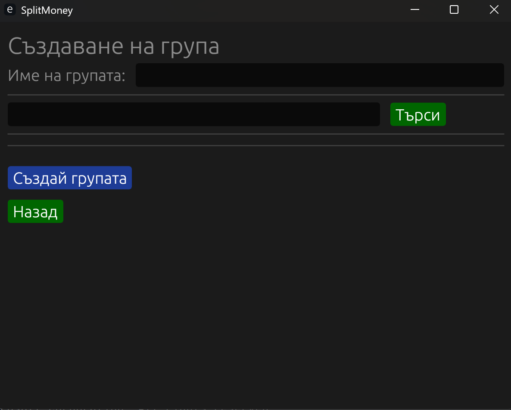

# SplitMoneyManager
Project for FMI course Programming with Rust. The project has the following features:
* Registration and login
* Group creation
* User search by email and username when creating a group
* Optimized expense distribution
* Visualization of debts and receivables
* Notifications for overdue payments
* Marking a user as a regular payer

# Screenshots

